# SaveLife
chatbot: https://youtu.be/ggHdAxYmKZg

## Grupo
* Ana Carolina Wichinieski da Costa - 86878
* Daniel Rodrigues Cariatte - 88223
* Gabriel Clara Rufino - 80205
* Pedro Marques Alencar Leite - 86902
* Wesley Rabachin R. - 86673

## Projeto
**Para baixar o Projeto clique em Code**
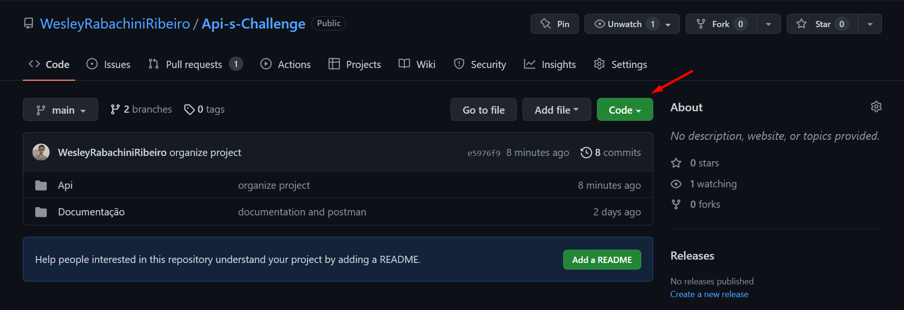

**Depois Clique em Download Zip**
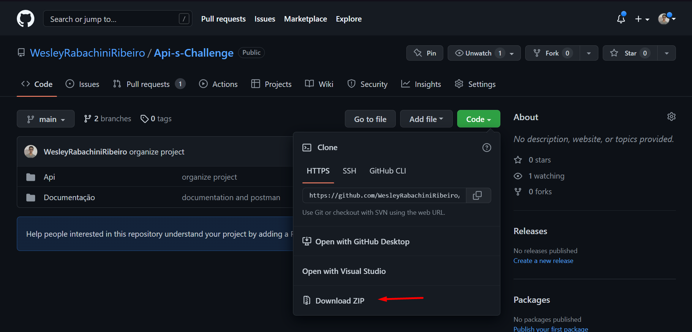

## API
**Após ter baixado o projeto abra o arquivo Api no *Intellij***
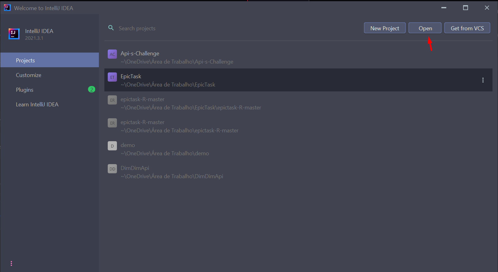

Após apertar o botão, selecione a pasta do projeto

**Com a pasta do Projeto aberta selecione Project File no Intellij, para ver todos os arquivos do Projeto**
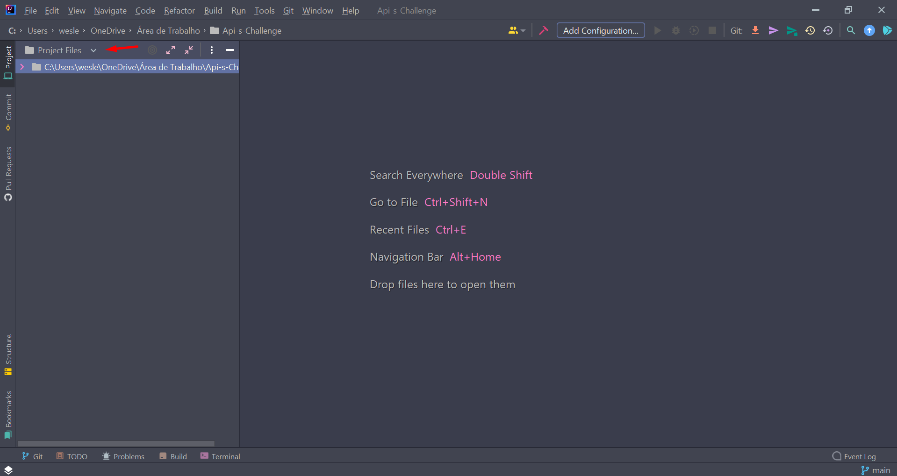

**Na pasta Api, abra a pasta SaveLife e procure pelo pom.xml**
**Após encontrar o arquivo pom.xml, aperte com o botão direito**
**Depois Clique Add as Maven project**
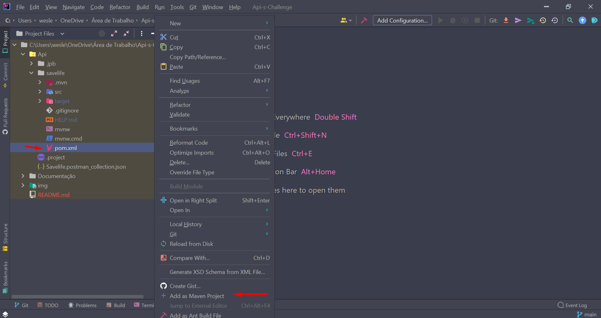

**Depois de adicionar o projeto como um projeto maven, clique no SavelifeApplication e em start**
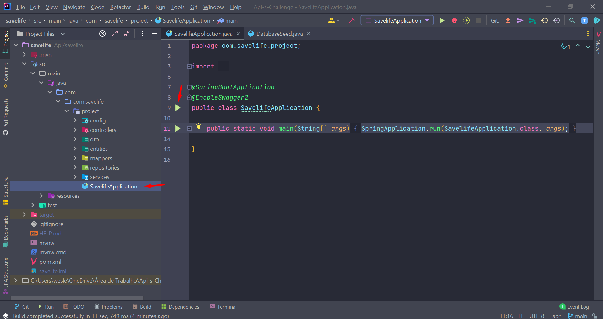

**Após isso a Api estará funcionando**
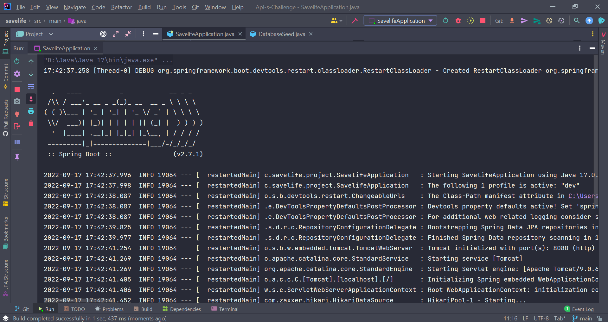

### Postman
**Para utilizar os endpoints pelo postman utilize a collection disponibilizada na pasta API**
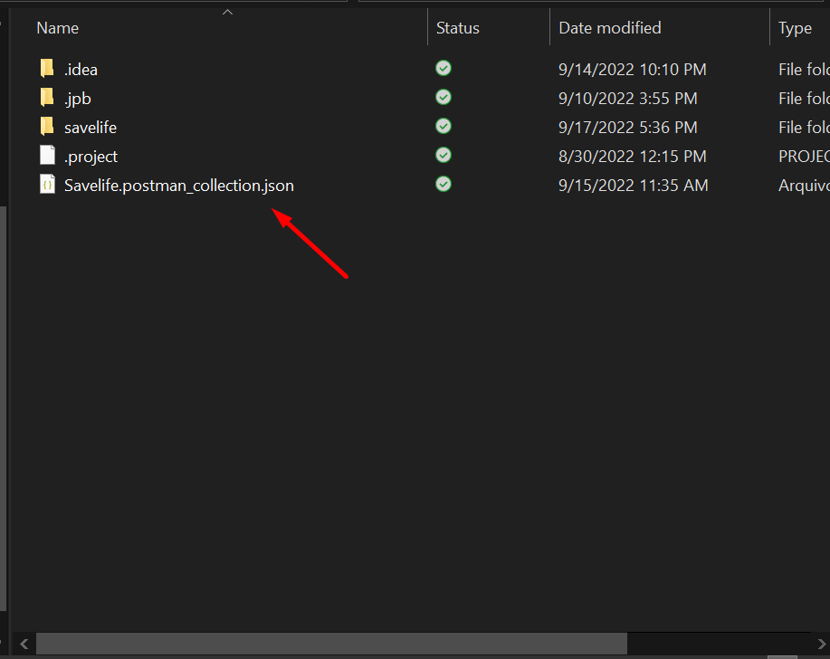

**No Postman clique em import**
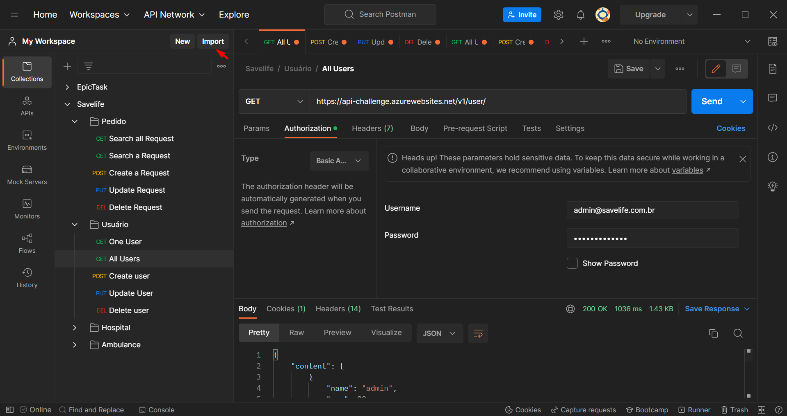

**Depois clique em Upload File e selecione o arquivo de collection disponibilizado**
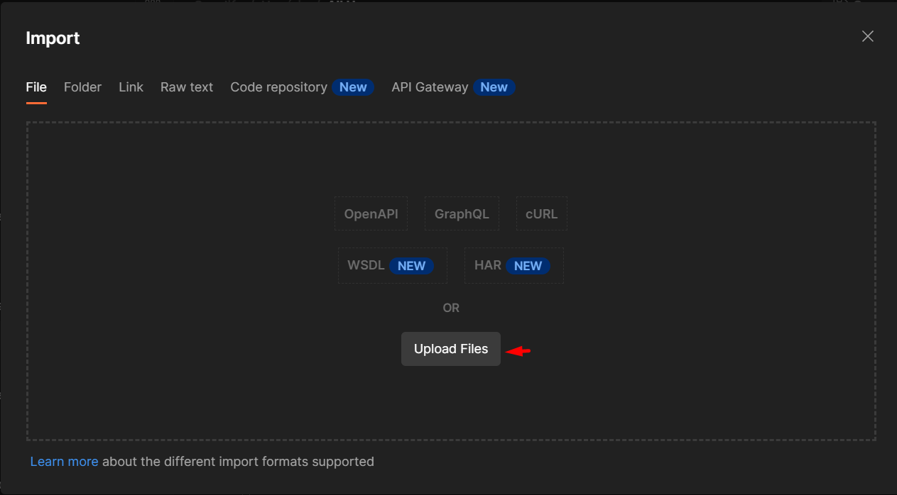

**Após selecionar o arquivo clique em importe e a Collection estará disponivel para você utilizar**
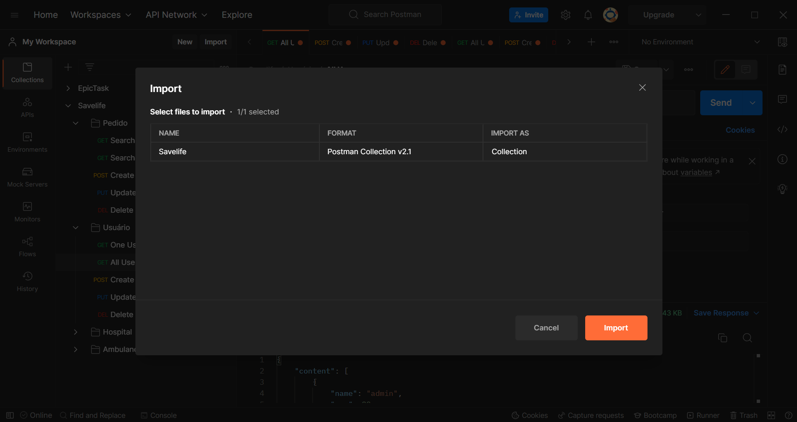

### Chatbot

**Para Inicializar o Chatbot na IBM, primeiro acesse sua conta da IBM Cloud**

**Na aba de Skills clique em: Create skill**
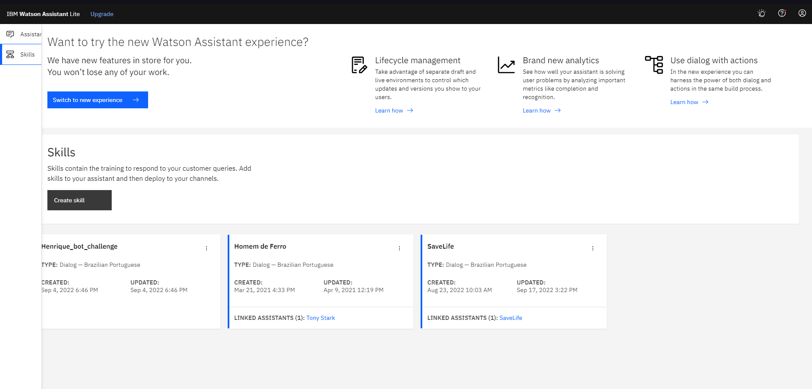

**Selecione a Dialog skill**
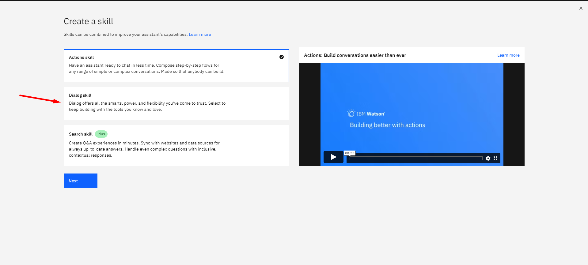

**Depois selecione a aba upload skill**
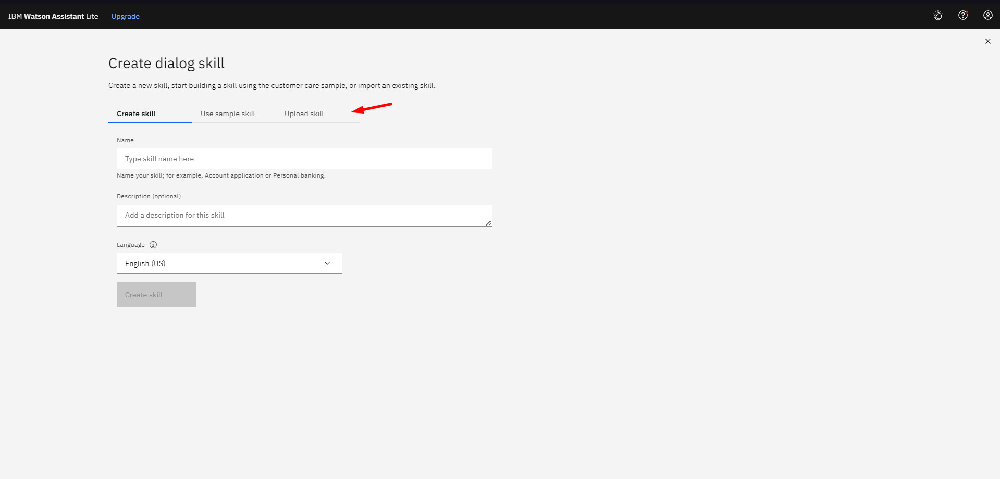

**Na aba de Upload Skill selecione o item e clique em Upload**
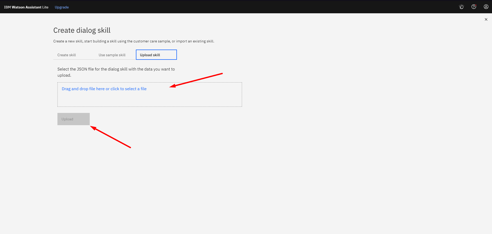

**Crie um Assistant**
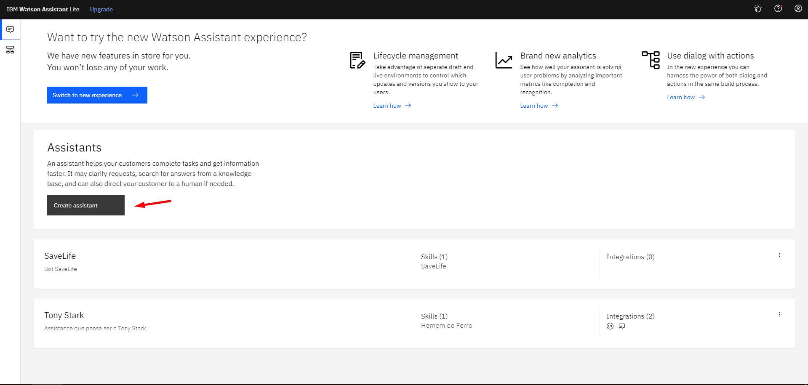

**Após criar seus assitente cliquem em: Add dialog skill**
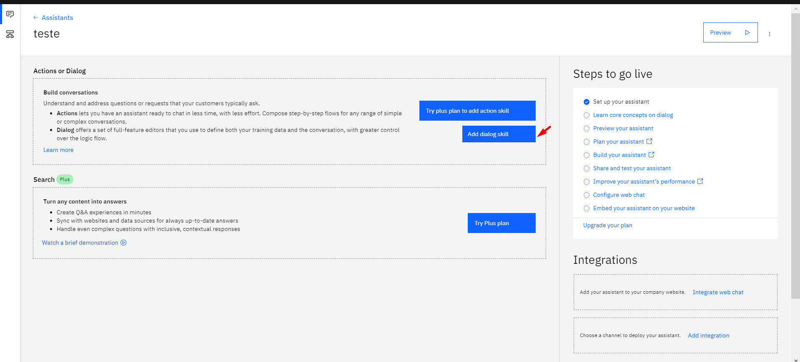

**Selecione a Skill da SaveLife**
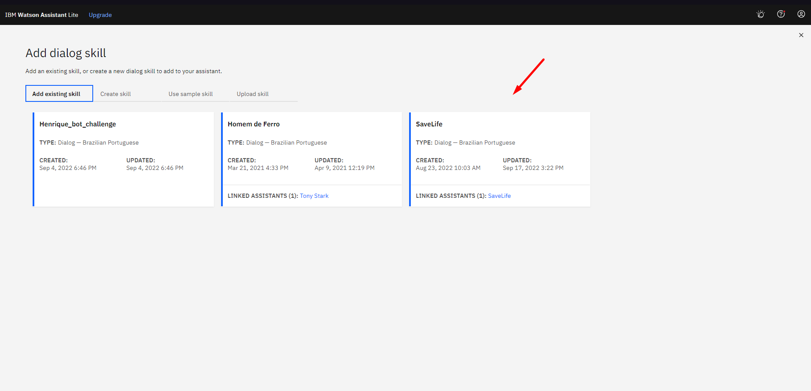

**Clique em Try It e divirta-se com o Bot**
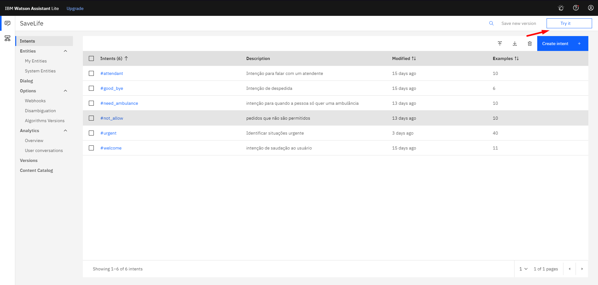